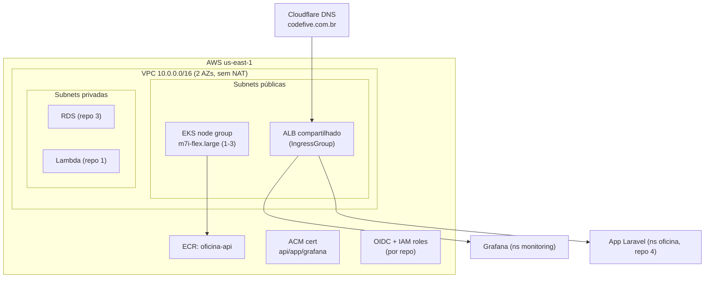

# oficina-k8s-infra

Infraestrutura Kubernetes na AWS (Terraform) do **Tech Challenge Fase 3 — Oficina Mecânica**. É o **repositório 2 de 4** e a fundação de toda a plataforma: a rede, o cluster, o registry, o ingress, o DNS/TLS, a observabilidade e as roles OIDC que as pipelines dos demais repositórios assumem.

| Repo | Papel |
|---|---|
| **oficina-k8s-infra** (este) | VPC, EKS, ECR, ALB Controller, ACM/DNS, monitoring, OIDC |
| [oficina-db-infra](https://github.com/MicaelHernandes/oficina-db-infra) | RDS PostgreSQL gerenciado |
| [oficina-auth-lambda](https://github.com/MicaelHernandes/oficina-auth-lambda) | Lambda de auth por CPF + API Gateway HTTP API |
| [oficina-api](https://github.com/MicaelHernandes/oficina-api) | Aplicação Laravel no EKS |

## Tecnologias

- **Terraform** (backend S3 + lock DynamoDB), providers `aws`, `cloudflare`, `kubernetes`, `helm`.
- **Amazon EKS** (K8s 1.31), managed node group `m7i-flex.large` **Spot** (1 nó, máx. 3) — HPA nativo. Tipo free-tier-eligible, exigido pelo Free plan da conta.
- **Amazon ECR**, **Amazon VPC** (2 AZs, **sem NAT Gateway** para reduzir custo).
- **AWS Load Balancer Controller** (Ingress → ALB) + **metrics-server** (HPA).
- **ACM** validado por DNS na **Cloudflare** (`codefive.com.br`).
- **kube-prometheus-stack** (Prometheus + Alertmanager + Grafana) + **Loki/Promtail**.
- **OIDC** GitHub Actions → AWS (uma IAM role por repositório).

## Arquitetura



O ALB é **único e compartilhado** entre `app.codefive.com.br` (repo 4) e `grafana.codefive.com.br` via `alb.ingress.kubernetes.io/group.name`, roteando por host.

## Módulos

| Módulo | Conteúdo |
|---|---|
| `modules/vpc` | VPC 2 AZs, subnets pub/priv, sem NAT, tags de subnet para o ALB Controller, VPC endpoint do CloudWatch Logs |
| `modules/eks` | Cluster EKS, node group `m7i-flex.large` (1–3), add-ons, access entry para o deploy da app |
| `modules/ecr` | Repositório `oficina-api`, lifecycle de 3 imagens |
| `modules/alb-controller` | IRSA + helm do AWS Load Balancer Controller + metrics-server |
| `modules/dns-tls` | Certificado ACM (SAN api/app/grafana) + registros de validação na Cloudflare |
| `modules/monitoring` | kube-prometheus-stack + Loki, Grafana via Ingress ALB, secret do admin |
| `modules/github-oidc` | OIDC provider + 1 IAM role por repo (trust por repo + branch `master`) |

## Pré-requisitos (bootstrap manual, já feito)

- Bucket S3 `oficina-tfstate-909314263457` (versionado) + tabela DynamoDB `oficina-tflock`.
- Secret `CLOUDFLARE_API_TOKEN` cadastrado no repo.
- Usuário IAM `terraform-admin-new` (AdministratorAccess) só na máquina do autor para o bootstrap do OIDC.

## Como validar localmente (sem custo, sem tocar a AWS)

```bash
terraform fmt -check -recursive
terraform init -backend=false
terraform validate
```

> `terraform apply` **não** deve ser rodado localmente (exceto o bootstrap OIDC abaixo). Um `plan` real requer credenciais e o backend S3.

## Bootstrap do OIDC (uma única vez, na máquina do autor)

As roles que as pipelines assumem precisam existir **antes** do primeiro deploy. Com o usuário `terraform-admin-new` configurado (`aws configure`):

```bash
terraform init
terraform apply -target=module.github_oidc
terraform output github_role_arns
```

Depois, para **cada** repositório, cadastre o ARN correspondente como secret `AWS_ROLE_ARN` e crie o environment `production`:

```bash
gh secret set AWS_ROLE_ARN -R MicaelHernandes/oficina-k8s-infra   -b "arn:aws:iam::909314263457:role/oficina-gha-oficina-k8s-infra"
gh secret set AWS_ROLE_ARN -R MicaelHernandes/oficina-db-infra    -b "arn:aws:iam::909314263457:role/oficina-gha-oficina-db-infra"
gh secret set AWS_ROLE_ARN -R MicaelHernandes/oficina-auth-lambda -b "arn:aws:iam::909314263457:role/oficina-gha-oficina-auth-lambda"
gh secret set AWS_ROLE_ARN -R MicaelHernandes/oficina-api         -b "arn:aws:iam::909314263457:role/oficina-gha-oficina-api"
```

## Deploy (automático)

Push/merge em `master` dispara `.github/workflows/deploy.yml` (`environment: production`), que aplica em duas fases:

1. `apply -target` de VPC + EKS + OIDC + ECR (cria o cluster; os providers `kubernetes`/`helm` dependem do endpoint do EKS).
2. `apply` completo (ALB Controller, monitoring, DNS/TLS, SSM).

PRs e pushes em `homolog` rodam `.github/workflows/ci.yml` (fmt, validate, tflint, `plan` comentado no PR) — **sem apply**.

## Outputs (também no SSM `/oficina/...`)

`cluster_name`, `cluster_endpoint`, `vpc_id`, `private_subnet_ids`, `public_subnet_ids`, `node_security_group_id`, `ecr_repository_url`, `certificate_arn`, `oidc_provider_arn`, `github_role_arns`.

## Custo estimado

Configuração enxuta, consumida dos créditos do Free plan:

| Item | ~US$/mês |
|---|---|
| Control plane do EKS | 73 |
| 1× `m7i-flex.large` **Spot** | 21 |
| ALB compartilhado (app + Grafana) | 16 |
| Volume raiz do nó (20 GB gp3) | 2 |
| RDS `db.t4g.micro` (repo 3) | Free tier |
| **Total** | **~112** |

Prometheus (retenção 6h) e Loki rodam sem volume, então não há EBS além do disco do nó. O VPC endpoint do CloudWatch Logs (~US$14) vem **desligado**; ligue com `enable_logs_vpc_endpoint = true` quando precisar dos logs da Lambda de auth. Para trocar Spot por capacidade garantida: `node_capacity_type = "ON_DEMAND"` (~US$70 em vez de ~US$21).

**Destruir o ambiente após a apresentação.** **Destruir após a apresentação.**

## Destruir tudo

```bash
terraform destroy   # remove EKS, ALB, VPC, ECR, ACM, monitoring
```

> Rode o `destroy` com o cluster ainda de pé para que o ALB Controller remova o ALB antes da VPC. Se o ALB ficar órfão, apague-o no console antes de destruir a VPC.

## Acesso ao cluster

```bash
aws eks update-kubeconfig --name oficina --region us-east-1
kubectl get nodes
kubectl get pods -n monitoring
```

Grafana: `https://grafana.codefive.com.br` (senha admin no Secrets Manager `/oficina/grafana/admin`).
